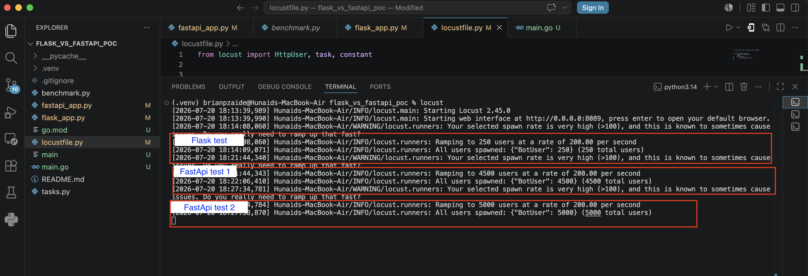
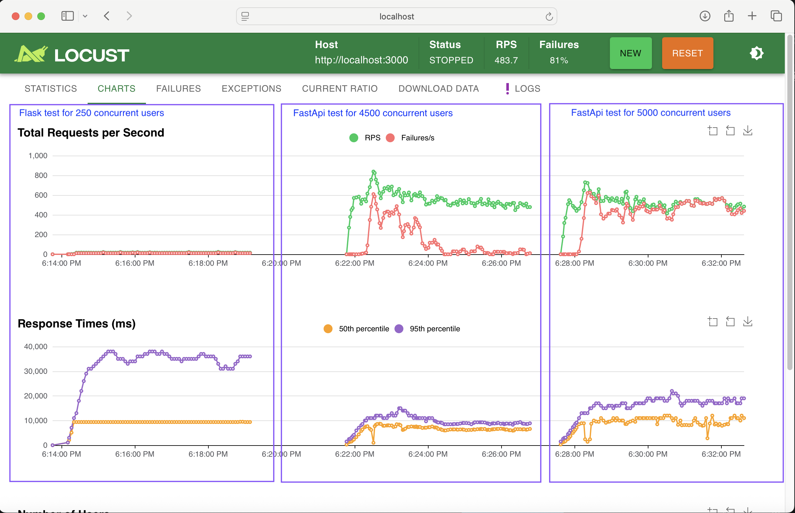
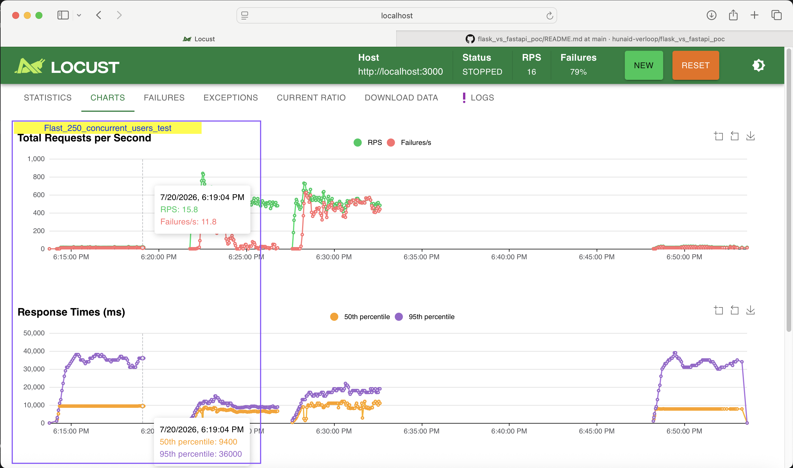
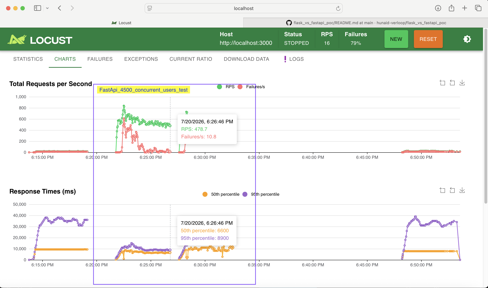
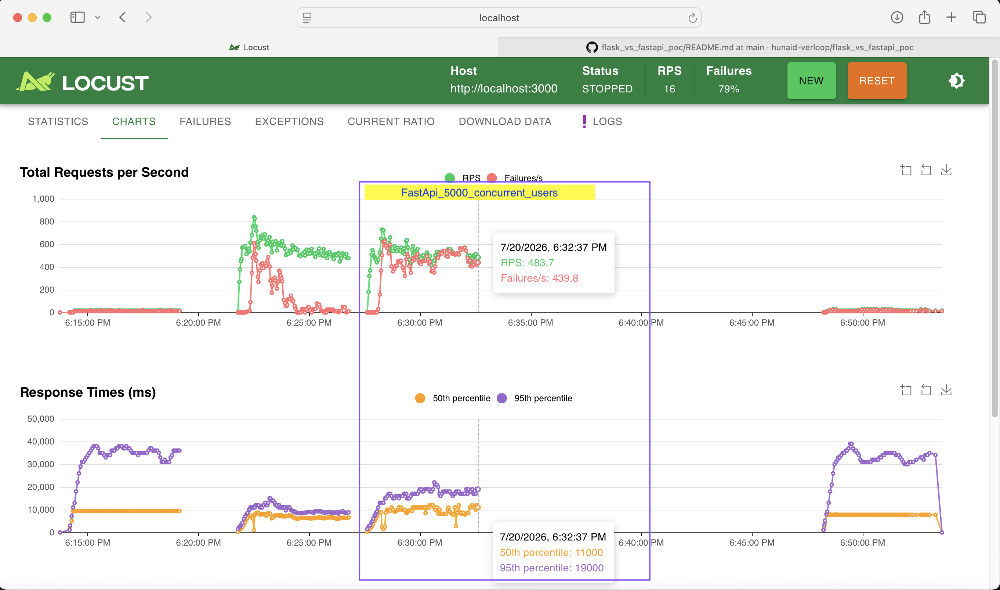

# flask_vs_fastapi_poc

### Objective

Evaluate the performance of Flask and FastAPI under an identical I/O-bound workload to determine whether migrating inbound services to FastAPI would provide scalability benefits.

### Test Setup

* Same application logic (I/O-bound)
* 4 worker processes for both applications
* Flask:

  ```bash
  gunicorn -w 4 -b 0.0.0.0:3000 flask_app:app
  ```
* FastAPI:

  ```bash
  uvicorn fastapi_app:app --host 0.0.0.0 --port 3000 --workers 4
  ```
* Load testing tool: Locust



### Results

| Framework | Concurrent Users | Error Rate | Requests/sec | MaxRPS before failure |
| --------- | ---------------: | ---------: | -----------: | --------------------: |
| Flask     |              250 |        80% |           16 |                  3.17 |
| FastAPI   |             4500 |        30% |          479 |                 531.3 |
| FastAPI   |             5000 |        80% |          483 |                 492.2 |







### Observations

* Under the tested I/O-bound workload, FastAPI sustained higher concurrency than Flask before reaching high failure rates.
* FastAPI achieved higher throughput (479 RPS vs. 16 RPS) while handling more concurrent users(4500 vs. 250).
* Increasing FastAPI load from 4500 to 5000 concurrent users did not increase throughput, but the error rate increased from 30% to 80%, due to test environment reaching saturation.
* The benchmark indicates that FastAPI performed better(for I/O-bound workloads). Based on these results, migrating services and existing Flask services to FastAPI would provide more throughput.